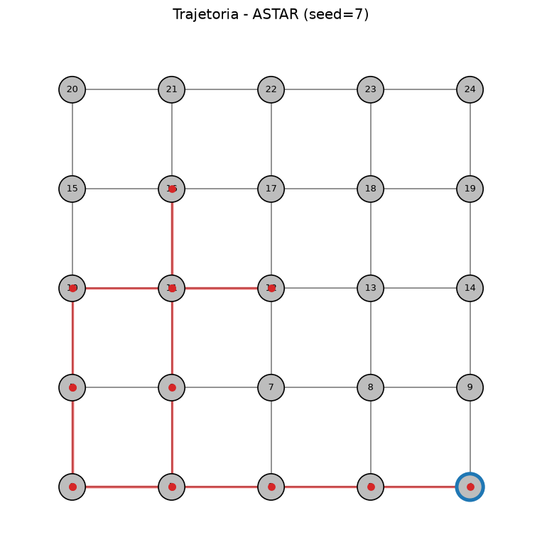
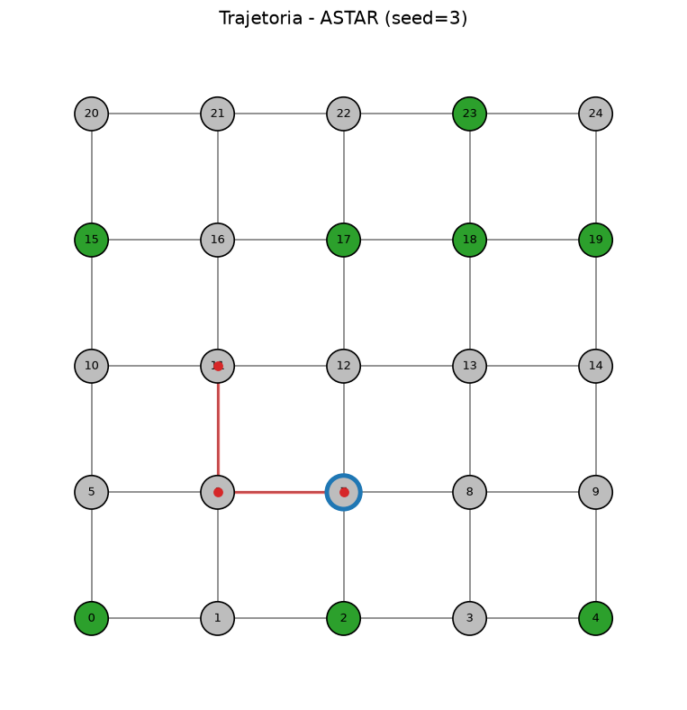

# Logística Reversa — Agentes Inteligentes (Unicesumar)

Projeto da Atividade MAPA de Inteligência Artificial — implementação completa que cobre os conceitos de **PEAS**, **classificação de ambientes**, **agentes reativos baseados em modelo** e **algoritmos de busca** (BFS, DFS, UCS, Greedy, A*) com visualização gráfica.

> **Status**: 8/8 PRs entregues. Implementação completa.

---

## O que o projeto demonstra

| Conceito (Russel & Norvig) | Onde está implementado |
|---|---|
| PEAS (Performance, Environment, Actuators, Sensors) | `domain/` + `agents/` |
| Ambiente parcialmente observável, dinâmico, estocástico, sequencial | `environment/warehouse.py` (eventos dinâmicos) |
| Agente baseado em modelo (ModelBasedAgent) com planejador A* e regra anti-retorno | `agents/model_based.py` |
| Algoritmos de busca (BFS, DFS, UCS, Greedy, A*) | `search/` |
| Heurísticas h(n) admissíveis (Manhattan, Euclidiana) | `search/heuristics.py` |
| Métricas comparativas | `reports/metrics.py` |
| Visualização com networkx + matplotlib | `visualization/plotter.py` |

---

## Como rodar (Windows / Linux / macOS)

> Dependências declaradas em `requirements.txt`:
> - `networkx>=3.0` — modelagem do grafo do armazém
> - `matplotlib>=3.5` — visualização da trajetória
> - `pandas>=1.5` — tabelas comparativas
> - `pytest>=7.0` — testes

```bash
python -m venv .venv
# Windows:
.venv\Scripts\activate
# Linux/macOS:
source .venv/bin/activate

pip install -r requirements.txt
```

> Requisito: Python ≥ 3.10.

---

## Como usar a CLI

A interface de linha de comando oferece quatro subcomandos:

```bash
# 1. Executa UMA simulacao e gera os artefatos (metrics, PNG, run.json).
python main.py run --rows 5 --cols 5 --max-steps 200 --seed 42 --planner astar

# 2. Compara varios planejadores e gera uma tabela comparativa.
python main.py compare --planners astar bfs --max-steps 100

# 3. Salva a topologia vazia de uma grade em JSON para reutilizacao.
python main.py snapshot --rows 5 --cols 5 --out data/warehouse.json

# 4. Agrega N `metrics.csv` de corridas previas em um relatorio final.
python main.py report --run-dirs pipeline-outputs/run1 pipeline-outputs/run2
```

Saídas geradas (em `pipeline-outputs/` por padrão):

| Arquivo | Conteúdo |
|---|---|
| `metrics.md` / `metrics.csv` | Tabela de uma linha com kg, coletas, energia, eficiência (PEAS) |
| `warehouse.png` | Grafo do armazém colorido por estado + trajetória do agente |
| `run.json` | Snapshot da configuração (reprodutibilidade) |
| `comparison.md` / `comparison.csv` | Tabela multi-linha (apenas no `compare`) |
| `relatorio-final.md` / `relatorio-final.csv` | Tabela agregada de N corridas (apenas no `report`) |

Atalhos prontos: `./run.sh` (Linux/macOS) ou `run.bat` (Windows) executam `python main.py run --rows 5 --cols 5`.

---

## Respostas da Questao 1 (MAPA)

A resposta completa de cada item vive em um arquivo dedicado na
pasta `docs/`. Aqui vai um resumo executivo + link para o detalhe.

### 1.1 — Descricao PEAS

| Componente | Resumo | Onde esta implementado |
|---|---|---|
| **P**erformance | Volume coletado (kg) / energia gasta / passos totais | `reports/metrics.py::RunMetrics` |
| **E**nvironment | Centro de distribuicao como grafo de setores com residuos dinamicos | `environment/warehouse.py` |
| **A**ctuators | Acoes discretas `MOVE`, `COLLECT`, `WAIT` | `agents/base.py::Action` + `services/simulation.py` |
| **S**ensors | `perceive()` recebe setores com residuo + vizinhos + estado interno | `agents/model_based.py` |

Detalhamento completo (incluindo a tabela P/E/A/S com todas as
sub-metricas, sensores e onde cada teste valida cada item):
**[docs/peas.md](docs/peas.md)**

### 1.2 — Classificacao do Ambiente

| Dimensao | Valor | Resumo da justificativa |
|---|---|---|
| Observabilidade | **Parcialmente observavel** | `perceive()` recebe apenas uma lista, nao o estado global |
| Determinismo | **Nao deterministico (estocastico)** | `deposit_random_waste` injeta residuos a cada passo com prob. `p` |
| Episodicidade | **Sequencial** | `AgentState.cleaned` guarda historico que afeta decisoes futuras |
| Estaticidade | **Dinamico** | Residuos surgem enquanto o agente delibera |
| Discretude | **Discreto** | Setores inteiros, acoes enumeradas, tempo em passos |

Justificativas completas (com trechos de codigo que comprovam cada
classificacao e a consequencia para o tipo de agente escolhido):
**[docs/ambiente-classificacao.md](docs/ambiente-classificacao.md)**

### 1.3 — Agente Reativo Baseado em Modelo

Em vez de transcrever um pseudocodigo didatico, esta secao
apresenta o **codigo real** que implementa o agente e mostra como
cada bloco atende ao requisito de "estado interno + regra
anti-retorno com cooldown T".

Resumo do comportamento (um passo de `act()`):

1. Se ha residuo no setor atual → `COLLECT` (regra reativa direta).
2. Caso contrario, filtra os goals pela regra `state.can_return(g)`
   — equivalente a "T passos minimos antes de revisitar".
3. Se nao sobra goal → `WAIT` (preserva energia).
4. Constroi `SearchProblem` com os goals restantes e chama o
   planejador injetado (default: A* com heuristica Manhattan).
5. Caminha para o segundo no do caminho planejado → `MOVE`.

Codigo completo de `act()` + estado interno (`AgentState`) +
mapeamento entre o pseudocodigo do enunciado e o codigo real:
**[docs/agente-baseado-em-modelo.md](docs/agente-baseado-em-modelo.md)**

### Exemplo visual de uma simulacao

A pasta `docs/example/` contem duas imagens geradas pelo mesmo
plotter (`logistica_reversa/visualization/plotter.py`), cada uma
evidenciando um aspecto diferente da simulacao:

**1. `warehouse.png` — simulacao completa (gerada pelo CLI)**

Gerada com `python main.py run --rows 5 --cols 5 --max-steps 50
--seed 7 --planner astar`. Por padrao, o subcomando `run` recarrega
o armazem **limpo** antes de plotar (ver `cli/parser.py:_write_run_artifacts`),
entao o grafo sai todo em cinza: o foco desta imagem eh a **trajetoria
completa** do agente em uma corrida longa.



**2. `warehouse-final.png` — estado final com residuos remanescentes**

Gerada com `python -m docs.example._regenerate` (script auxiliar em
`docs/example/_regenerate.py`, seed=3, max_steps=4, fracao inicial de
residuos 0.4, sem deposito dinamico). Diferente do CLI, este script
plota o armazem **no estado final** da simulacao, entao todos os
elementos da legenda aparecem de uma vez:



Legenda das cores (conforme `logistica_reversa/visualization/plotter.py`):

- **Verde**: setor com residuo ainda nao coletado.
- **Cinza**: setor vazio (sem residuo no instante da captura).
- **Linha vermelha**: trajetoria do agente (ordem cronologica dos setores visitados).
- **Borda azul destacada**: setor onde o agente parou ao fim da simulacao (ultimo da trajetoria).

A imagem 1 mostra a trajetoria; a imagem 2 mostra como ler o estado
final do armazem. Juntas, dao a visao completa do que o plotter
representa.

---

## Estrutura do projeto (Clean Architecture)

```
logistica_reversa/
├── main.py                  CLI argparse
├── domain/                  Modelos puros (enums, dataclasses)
├── environment/             Grafo + eventos dinâmicos
├── search/                  BFS, DFS, UCS, Greedy, A*, heurísticas
├── agents/                  Agente baseado em modelo
├── services/                Simulação
├── reports/                 Métricas com pandas
├── visualization/           Matplotlib
├── data/                    JSON do armazém
└── tests/                   Pytest
```

### Decisões de engenharia (por que essa estrutura?)

1. **Clean Architecture** — `domain` não depende de nada; agentes e buscas dependem só dele. Testável sem framework.
2. **Strategy Pattern** — `BaseAgent` permite trocar algoritmo de decisão sem mudar a simulação.
3. **Open/Closed** — adicionar novo agente = novo arquivo, sem mexer no que existe.
4. **Inversão de dependência** — `Simulation` depende de `BaseAgent`, não de classe concreta.
5. **Princípio da Responsabilidade Única** — cada módulo tem UMA razão para mudar.

---

## Plano de PRs

| # | Conteúdo |
|---|---|
| 1 | Documentação inicial + `requirements.txt` + `.gitignore` (este PR) |
| 2 | `domain/` (enums, dataclasses) + testes |
| 3 | `environment/` (grafo do armazém + gerador) + testes |
| 4 | `search/` (BFS, DFS, UCS, Greedy, A*, heurísticas) + testes |
| 5 | `agents/` (ModelBasedAgent com A* + regra anti-retorno) + testes |
| 6 | `services/simulation.py` + `reports/metrics.py` + testes |
| 7 | `visualization/plotter.py` + `main.py` (CLI) + `data/warehouse.json` + scripts |
| 8 | README final + validação completa |

---

## Referência

RUSSELL, S.; NORVIG, P. *Artificial Intelligence: A Modern Approach*. 4ª ed. Pearson, 2020.
JUNIOR, M. M. C. *Inteligência Artificial*. Maringá: Unicesumar, 2022.